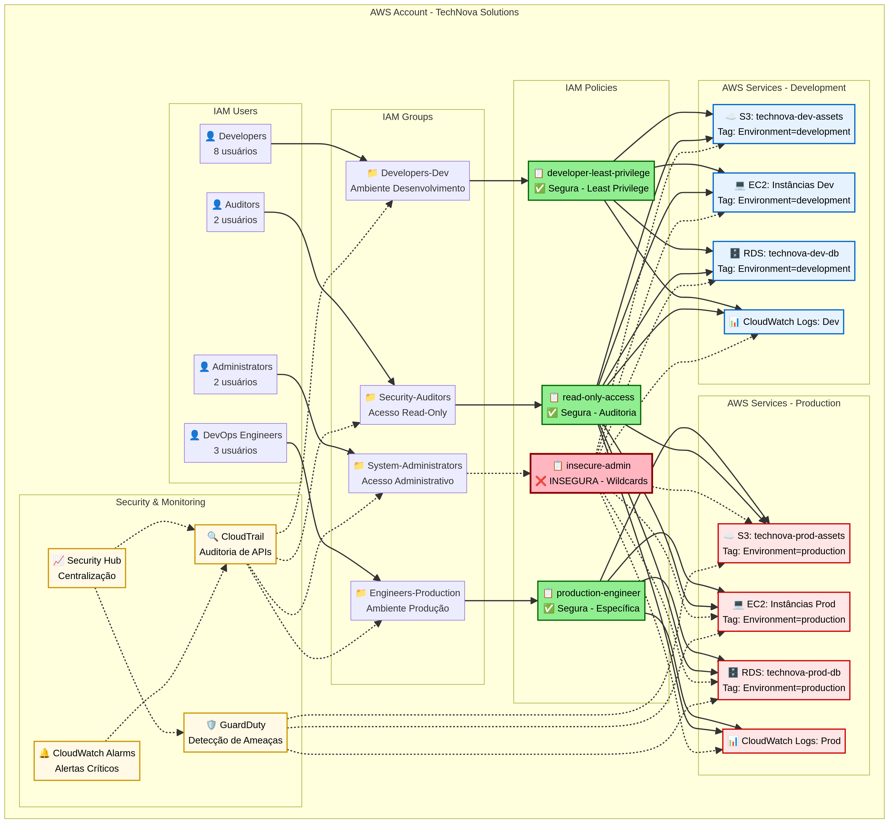

# AWS Cloud Security – IAM & Governança


## 📋 Sobre o Projeto

Este projeto demonstra conhecimentos fundamentais de **segurança em cloud computing** através da análise, implementação e documentação de políticas de **AWS Identity and Access Management (IAM)** e práticas de governança corporativa.

O repositório simula um cenário corporativo real, comum em times de segurança, auditoria e governança, onde é necessário identificar riscos, aplicar o princípio do menor privilégio e documentar decisões técnicas de forma clara e profissional.

### Autor e Informações

| Detalhe | Informação |
| :--- | :--- |
| **Autor** | Rafael Garcez |
| **LinkedIn** | [linkedin.com/in/rgarcez7](https://www.linkedin.com/in/rgarcez7/) |
| **Escola da Nuvem** | Turma BRASAO 227 |
| **Disciplina** | Competências Profissionais |

## 🎯 Objetivos de Aprendizagem

*   **Análise de Políticas IAM:** identificação de permissões excessivas e vulnerabilidades
*   **Princípio do Menor Privilégio:** implementação de controles de acesso baseados em necessidade real
*   **Governança em Cloud:** aplicação de frameworks e boas práticas corporativas
*   **Documentação Técnica:** comunicação clara de decisões de segurança e análise de riscos
*   **Pensamento Crítico:** análise de incidentes e proposição de medidas corretivas

## 🏢 Cenário Simulado

| Detalhe | Informação |
| :--- | :--- |
| **Empresa** | TechNova Solutions |
| **Segmento** | E-commerce em crescimento |
| **Infraestrutura** | AWS Cloud (S3, EC2, RDS, CloudWatch) |
| **Desafio** | Revisar e corrigir políticas IAM após auditoria de segurança |

A TechNova Solutions identificou vulnerabilidades em suas políticas de acesso após um incidente de segurança. Este projeto documenta a análise realizada, os riscos identificados e as correções implementadas seguindo as melhores práticas da AWS.

## 📊 Diagrama de Arquitetura IAM

Para facilitar a visualização das relações entre usuários, grupos, roles e permissões:



## 📁 Estrutura do Repositório

```
aws-cloud-security-iam-governance/
├── README.md
├── PROJECT_GUIDE.md
├── policies/
│ ├── insecure-admin.json
│ ├── developer-least-privilege.json
│ └── read-only.json
├── analysis/
│ ├── risk-analysis.md
│ ├── least-privilege.md
│ ├── common-iam-mistakes.md
│ └── security-checklist.md
├── case/
│ └── security-incident-case.md
└── diagrams/
    └── iam-architecture.png
```

## 🚀 Navegação do Repositório

*   **[README.md](README.md):** visão geral do projeto
*   **[case/security-incident-case.md](case/security-incident-case.md):** estudo de caso completo
*   **[policies/](policies/):** exemplos práticos de políticas JSON
*   **[analysis/](analysis/):** análises de risco, checklists e boas práticas
*   **[diagrams/](diagrams/):** diagramas de arquitetura e fluxos
*   **[PROJECT_GUIDE.md](PROJECT_GUIDE.md):** guia detalhado de implementação

## 📌 Estudo de Caso: Incidente de Segurança IAM

Simulação de incidente real envolvendo falhas de IAM:

| Métrica | Valor |
| :--- | :--- |
| **Dados Expostos** | 200GB / 150.000 registros de clientes |
| **Duração do Comprometimento** | 4 dias |
| **Tempo de Detecção** | 76 horas |
| **Tempo de Contenção** | 2 horas após detecção |
| **Custo Direto Estimado** | R$ 173.500 |
| **Indisponibilidade de Sistemas** | 6 horas |
| **Lições Aprendidas** | menor privilégio, MFA obrigatório, monitoramento contínuo, segregação de ambientes |

[📄 Ler estudo completo →](case/security-incident-case.md)

## 🔐 Tecnologias e Conceitos

### Tecnologias AWS

*   **IAM:** Gerenciamento de identidades e acessos
*   **S3:** Armazenamento de objetos
*   **EC2:** Servidores virtuais
*   **RDS:** Banco de dados gerenciado
*   **CloudWatch:** Monitoramento e logs

### Conceitos de Segurança

*   **Least Privilege**
*   **Zero Trust**
*   **Defense in Depth**
*   **Separation of Duties**
*   **IAM Policies**
*   **Resource-Based Permissions**

## 📊 Principais Entregas

1.  **Políticas IAM Documentadas**
    *   Política insegura (permissões excessivas)
    *   Política corrigida (least privilege)
    *   Política read-only
2.  **Análise de Riscos**
    *   Impacto potencial
    *   Probabilidade de ocorrência
    *   Medidas de mitigação
3.  **Caso de Incidente Real**
    *   Contexto e cronologia
    *   Análise de causa raiz
    *   Medidas corretivas implementadas
    *   Lições aprendidas
4.  **Documentação de Boas Práticas**
    *   Checklist e recomendações para ambientes reais

## 🎓 Aprendizados e Competências

**Funções relacionadas:**

*   Cloud Security Engineer
*   DevSecOps Engineer
*   Cloud Governance Analyst
*   Security Auditor
*   IAM Specialist

**Competências demonstradas:**

*   ✅ Leitura e interpretação de políticas IAM em JSON
*   ✅ Identificação de vulnerabilidades de segurança
*   ✅ Aplicação de frameworks de segurança (AWS Well-Architected)
*   ✅ Documentação técnica clara e estruturada
*   ✅ Pensamento analítico e resolução de problemas
*   ✅ Comunicação de conceitos técnicos complexos


## 📚 Referências e Recursos

*   [AWS IAM Best Practices](https://aws.amazon.com/iam/best-practices/)
*   [AWS Well-Architected Framework - Security Pillar](https://aws.amazon.com/architecture/well-architected/?wa-lens-security)
*   [Princípio do Menor Privilégio (NIST)](https://csrc.nist.gov/glossary/term/least_privilege)
*   [AWS Security Documentation](https://aws.amazon.com/security/)
*   [CIS AWS Foundations Benchmark](https://www.cisecurity.org/benchmark/aws)

## 📝 Observações

Este projeto não requer acesso ativo à AWS Console. Todos os exemplos são fictícios, mas simulam cenários reais de mercado.
Perfeito para iniciantes-júnior e alinhado com os conteúdos da Escola da Nuvem – AWS.

## 📞 Contato

*   **Rafael Garcez**
*   **LinkedIn:** [linkedin.com/in/rgarcez7](https://www.linkedin.com/in/rgarcez7/)
*   **Escola da Nuvem:** Turma BRASAO 227

## 📄 Licença

Este projeto foi desenvolvido para fins educacionais como parte do programa da Escola da Nuvem – AWS.

⭐ Se este projeto foi útil para você, considere deixar uma estrela no repositório!
